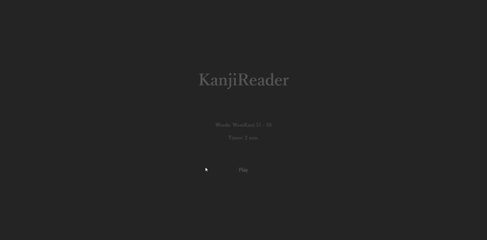
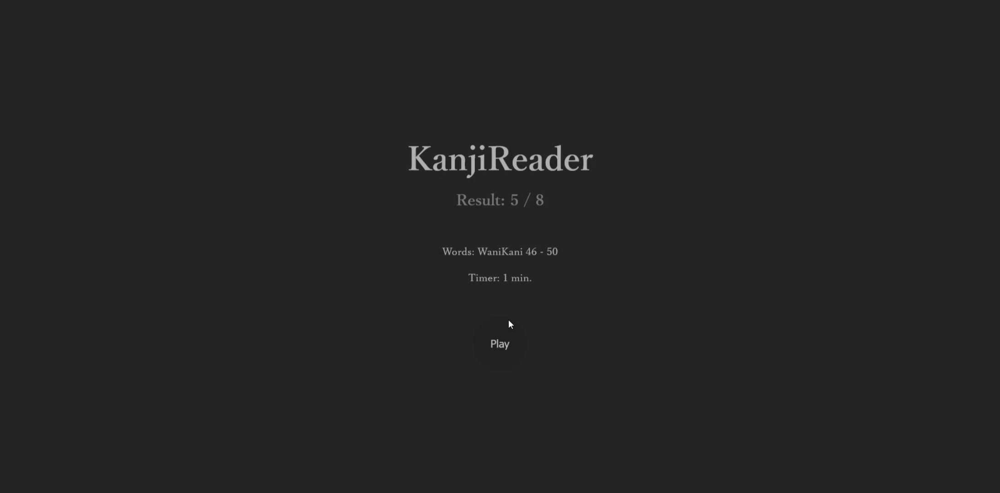
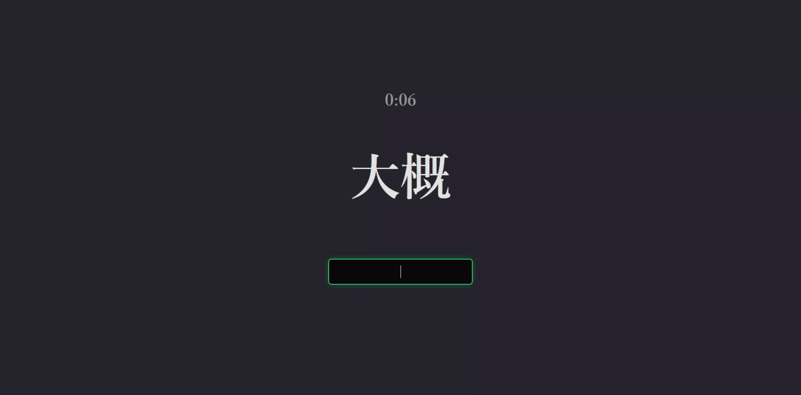

# KanjiReader

Веб-приложение - тренажер по прочтению японских иероглифов (кандзи)

Фронтэнд написан на React / Vite / JavaScript

Бэкэнд - на Scala / ZIO HTTP
<hr>

## Запуск 

### Backend (Scala)
```bash
# Перейдите в директорию бэкенда
cd ./KanjiReaderBack;
```
```bash
# Запустите сервер
sbt run;
```

### Frontend (React/Vite)
```bash
# Перейдите в директорию фронтенда  
cd ./KanjiReaderFront
```
```bash
# Установите зависимости
npm install
```
```bash
# Запустите dev сервер
npm run dev
```


<hr>

## О приложении

### 1. Выбери список слов, а также таймер (или его отсутствие)



### 2. Видишь слово - напиши как оно произносится (на латинице)

Успей как можно больше! Ответишь неверно - покажет ответ



### 3. Посмотри на результаты, и еще раз пробегись по словам, в которых ошибся

Игру можно всегда можно закончить клавишей Escape




При перезагрузке страницы выбранные параметры сохраняются (в localStorage)

Также на бэкэнде реализована регистрация, но пока не используется