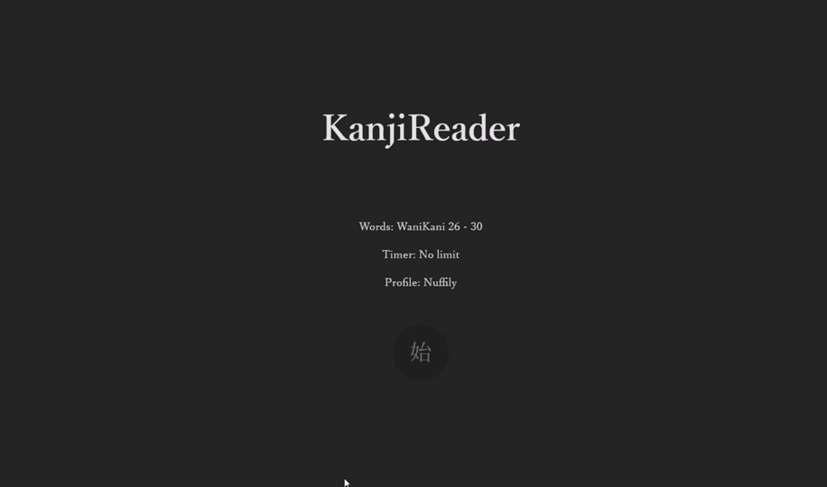
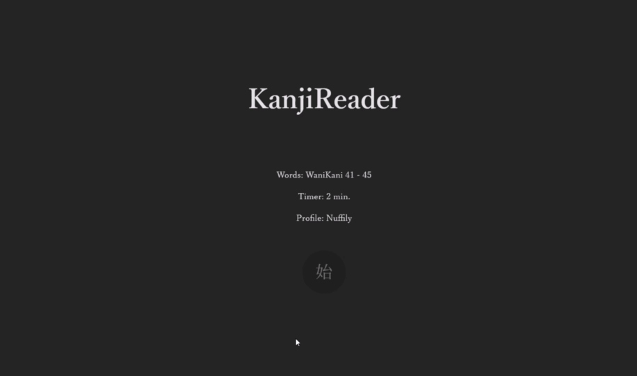
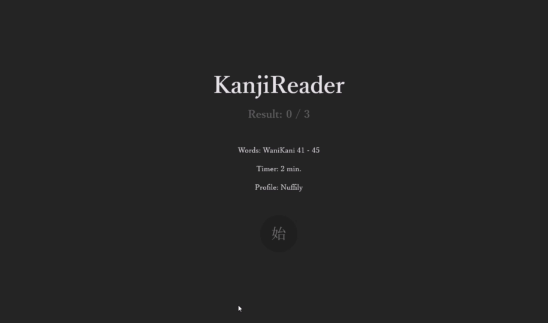

# KanjiReader

Веб-приложение - тренажер по прочтению японских иероглифов (кандзи)

Фронтэнд написан на React / Vite / JavaScript

Бэкэнд - на Scala / ZIO HTTP
<hr>

## Запуск

### Backend (Scala)

```bash
# Перейдите в директорию бэкенда
cd ./KanjiReaderBack;
```

```bash
# Запустите сервер
sbt run;
```

### Frontend (React/Vite)

```bash
# Перейдите в директорию фронтенда  
cd ./KanjiReaderFront
```

```bash
# Установите зависимости
npm install
```

```bash
# Запустите dev сервер
npm run dev
```

<hr>

## О приложении

### Выбор слов и времени

Можно выбрать список слов, которые будут попадаться и засечь таймер на игру, либо же убрать ограничение

После авторизации у каждого списка слов отображается процент правильных ответов за последние пять игр



### Профиль

Реализована авторизация через гитхаб, доступно 3 квеста, которые обновляются каждые 4 часа. За их выполнение дается опыт

Светлая тема, для любителей поярче



### Игра

Видишь слово - напиши латиницей, как оно произносится. Если оно заканчивается каной, ее можно не дописывать

Игру можно всегда можно закончить клавишей Escape



### Результаты

По окончании игры можно посмотреть свои результаты и без спешки отпечатать неизвестные слова в памяти


---

При перезагрузке страницы выбранные параметры сохраняются (в localStorage)

